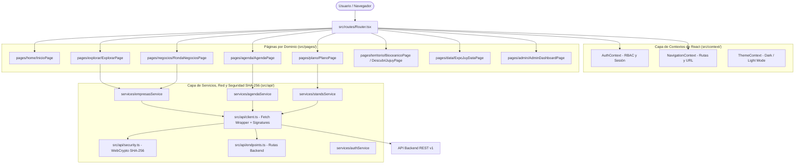

# Arquitectura del Sistema — ExpoJuy Event Website

## 📌 Introducción

Este documento describe la arquitectura de software seleccionada para la plataforma **ExpoJuy Event Website**, construida sobre **React 19 + TypeScript + Vite + Tailwind CSS v4**.

El proyecto migró de una estructura monolítica (`App.tsx` único) a una **Arquitectura Modular Orientada a Dominios y Funcionalidades (Domain-Driven & Feature-Based Architecture)**.

---

## 📐 Principios de Diseño Aplicados

### 1. Separación de Responsabilidades (Separation of Concerns - SoC)

Cada módulo del sistema tiene un propósito único y bien delimitado:

- **UI / Presentación**: Componentes visuales desacoplados en `src/components/` y páginas por módulo en `src/pages/`.
- **Lógica de Negocio y Estado**: Gestionados mediante Contextos de React (`src/context/`).
- **Formularios**: Encapsulados en `src/forms/` con validación y UI genérica.
- **Capa de Red y Seguridad API**: Centralizada en `src/api/` con firmas criptográficas SHA-256 sin llamadas `fetch` directas desparramadas en la interfaz.
- **Configuración Global**: Centralizada en `src/config/`.

### 2. Control de Acceso Basado en Roles (RBAC - Role-Based Access Control)

La aplicación cuenta con un sistema de roles (`visitor`, `exhibitor`, `press`, `admin`) con matriz declarativa de permisos en `src/config/roles.config.ts`, permitiendo ocultar o restringir secciones mediante el componente `RoleGuard.tsx`.

### 3. Capa de Seguridad Transaccional SHA-256

Todas las peticiones enviadas al servidor backend incluyen una firma criptográfica SHA-256 (`X-Payload-Signature`, `X-Payload-Hash`, `X-Request-Timestamp`) calculada mediante la API nativa **Web Crypto**, garantizando autenticidad e inmunidad ante manipulación de paquetes (*anti-tampering*).

### 4. Enrutamiento Dinámico y Sincronización de URL

Se utiliza un enrutador React nativo liviano desacoplado de dependencias pesadas externamente, con sincronización de la API `window.history.pushState` e inicialización basada en la ruta activa (`/explorar`, `/agenda`, `/negocios`, etc.).

---

## 🔄 Diagrama de Flujo Arquitectónico

